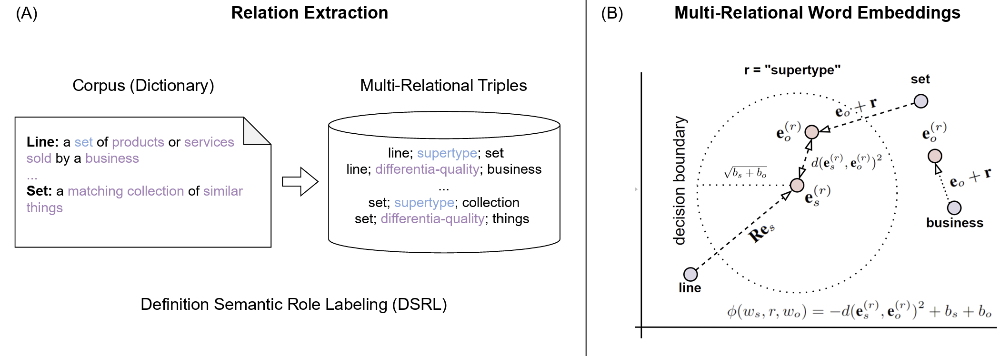

# Multi-Relational Hyperbolic Word Embeddings from Natural Language Definitions (EACL 2024 - Main Track)



Natural language definitions possess a recursive, self-explanatory semantic structure that can support representation learning methods able to preserve explicit conceptual relations and constraints in the latent space. This paper presents a multi-relational model that explicitly leverages such a structure to derive word embeddings from definitions. By automatically extracting the relations linking defined and defining terms from dictionaries, we demonstrate how the problem of learning word embeddings can be formalised via a translational framework in Hyperbolic space and used as a proxy to capture the global semantic structure of definitions. An extensive empirical analysis demonstrates that the framework can help imposing the desired structural constraints while preserving the semantic mapping required for controllable and interpretable traversal. Moreover, the experiments reveal the superiority of the Hyperbolic word embeddings over the Euclidean counterparts and demonstrate that the multi-relational approach can obtain competitive results when compared to state-of-the-art neural models, with the advantage of being intrinsically more efficient and interpretable.

- Full paper: https://arxiv.org/abs/2305.07303

- Video presentation: https://youtu.be/cu8AcRFZ-3w?si=mMEHm7qNTuTKmCxU

# Reproducibility

Welcome! :) 

In this repository, you can find the code to reproduce the results presented in our EACL 2024 [paper](https://arxiv.org/abs/2305.07303).

The code for training the multi-relational embeddings is adapted from the [Multi-relational Poincaré Graph Embeddings](https://github.com/ibalazevic/multirelational-poincare) repository.


**Training Multi-Relational Word Embeddings:**

To train the euclidean embeddings, run the following command:

`CUDA_VISIBLE_DEVICES=0 python ./multi_relational_training.py --model euclidean --dataset cpae --num_iterations 300 --nneg 50 --batch_size 128 --lr 50 --dim 300`

To train the hyperbolic embeddings, run the following command:

`CUDA_VISIBLE_DEVICES=0 python ./multi_relational_training.py --model poincare --dataset cpae --num_iterations 300 --nneg 50 --batch_size 128 --lr 50 --dim 300`


**Evaluation:** 

Once trained, the embeddings can be evaluated running `./evaluate_similarity.py` and `./evaluate_similarity_poincare.py`.


Benchmarks:

SimVerb-3500 is a dataset specifically designed for evaluating the performance of computational models on verb similarity. It serves as a benchmark for semantic similarity models, particularly focusing on verbs, which are often more complex to model semantically compared to nouns due to their functional and dynamic nature in language. The SimVerb-3500 dataset tests a model's ability to determine how similar two verbs are in meaning. This is crucial for tasks like semantic analysis, information retrieval, and natural language understanding systems that require an in-depth understanding of action and state dynamics in language.

SimVerb-3500 Evaluates Verb Similarity, with the primary evaluation involving the measuring of how well a model can predict the degree of semantic similarity between pairs of verbs. This is usually quantified by human-rated scores which the models aim to approximate. It assesses the effectiveness of different word embedding and language models in capturing verb similarities. Models like Word2Vec, GloVe, and more advanced neural representations are often tested against this benchmark. Since verbs carry complex and subtle semantic changes depending on their context and usage, SimVerb-3500 provides a way to evaluate these nuances more effectively than general word similarity tasks.

SimVerb-3500 addresses a specific gap in semantic similarity benchmarks by focusing solely on verbs. It helps in understanding model capabilities and limitations in dealing with verb semantics, which are integral to processing natural language at a deeper level. This benchmark is valuable for researchers and developers working in the field of computational linguistics and NLP, providing insights into how models handle one of the more challenging aspects of language understanding.


The MEN dataset is a benchmark designed to evaluate the effectiveness of computational models in estimating the degree of semantic relatedness between English words. It specifically assesses how well models can capture the semantic relationships that exist between word pairs, providing a clear measure of their performance in tasks involving semantic understanding.

Key Features of MEN:
Semantic Relatedness: Unlike some datasets that focus solely on semantic similarity (how similar two words are in meaning), MEN looks at semantic relatedness, which includes any kind of semantic relationship, not just synonyms. For instance, "car" and "gasoline" would be considered related because of their contextual association, even though they are not similar.

Composition of the Dataset: MEN consists of a collection of word pairs along with human-assigned scores that indicate the strength of their semantic relationship. These scores are used as the ground truth to evaluate the performance of NLP models.

Development and Test Splits: The dataset is often divided into two sets: MEN-dev (development) and MEN-test (test). MEN-dev is typically used to fine-tune models or during the development phase, while MEN-test is used for final evaluation to assess model performance.

Uses of MEN-dev:
Model Training and Validation: Developers use MEN-dev to train and adjust their models, including tuning hyperparameters and validating intermediate model architectures during the development of semantic analysis tools.

Benchmarking: It provides a standard against which various models (such as those based on neural networks, vector space models, or others) can be benchmarked to compare their ability to understand and process language at a semantic level.

Research: It aids in research by offering a well-defined challenge for exploring new methods and techniques in semantic analysis, helping to push forward the field of computational linguistics and natural language processing.

The MEN-dev benchmark is particularly valuable because it helps ensure that models can handle real-world linguistic tasks that involve understanding the nuanced ways in which words can be related, beyond mere similarity. This makes it a crucial tool for developing more sophisticated and effective NLP systems.


**Baselines:** 

The script `./sentence_bert_baseline.py` contains the code to evaluate the [Sentence-Tansformer](https://www.sbert.net/docs/pretrained_models.html) models.  


**Definition Semantic Roles:** 

The pre-trained distilbert annotator used in our work can be downloaded via `./models/get_annotators.sh`.

Alternatively, you can access the model and the dataset adopted for training the semantic annotator [here](https://drive.google.com/drive/folders/12nJJHo7ryS6gVT-ukE-BsuHvAqPLUh3S).

The full set of automatically annotated definitions and the resulting multi-relational triples for training the embeddings are available in `./data/*`


## Reference
If you find this repository useful, please consider citing our paper!

```
@misc{valentino2024multirelational,
      title={Multi-Relational Hyperbolic Word Embeddings from Natural Language Definitions}, 
      author={Marco Valentino and Danilo S. Carvalho and André Freitas},
      year={2024},
      eprint={2305.07303},
      archivePrefix={arXiv},
      primaryClass={cs.CL}
}
```

For any issues or questions, feel free to contact us at marco.valentino@idiap.ch

